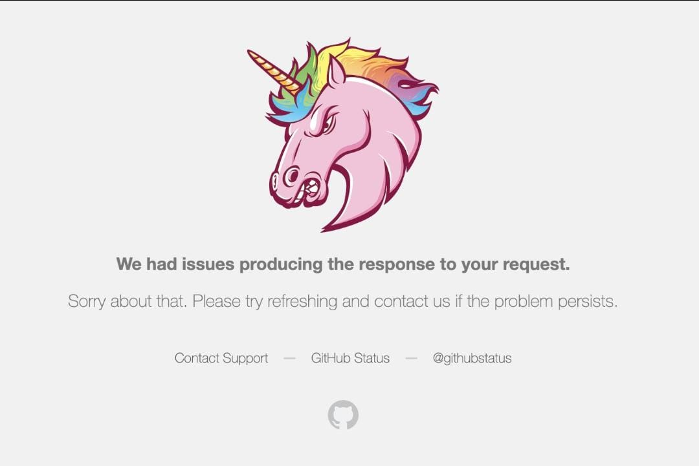

# 🚨Postmortem Report: GitHub Outage Incident🚨

  

## Issue Summary
- **Duration**: August 14, 2024, 23:02 UTC to August 14, 2024, 23:38 UTC (36 minutes)
- **Impact**🌍 All GitHub services on GitHub.com were inaccessible for 100% of users. Repository access, pull requests, issues, CI/CD pipelines, and other core features were completely unavailable. Users were unable to perform git operations or access the GitHub platform during this period globally.
- **Root Cause**: A misconfiguration in the database traffic routing setup caused critical services to lose connectivity to the database, leading to the outage.

## Timeline
- **23:02 UTC**: Monitoring alerts triggered, indicating a total outage across all GitHub services. Database connectivity dropped to zero.
- **23:05 UTC**: On-call engineers received automated alerts and began investigating the issue. Initial suspicion was a database overload.
- **23:08 UTC**: Engineers confirmed that the application layer was healthy but not communicating with the database, pointing to a database connectivity issue.
- **23:10 UTC**: Network and database diagnostics were performed. Database logs showed no spikes in load, ruling out traffic overload or DDoS.
- **23:15 UTC**: The database team was escalated to investigate potential misconfigurations in the recent infrastructure updates.
- **23:20 UTC**: A misconfiguration in database traffic routing was identified as the root cause during a review of recent configuration changes.
- **23:22 UTC**: Engineers prepared to revert the recent database traffic routing configuration.
- **23:25 UTC**: The configuration was reverted, restoring database connectivity. Services began recovering gradually.
- **23:30 UTC**: Monitoring showed that GitHub services were starting to recover, and error rates were dropping.
- **23:38 UTC**: Full service restoration confirmed, with normal traffic patterns and system stability returned.

## Root Cause and Resolution

## Root Cause

The outage was caused by a misconfiguration in the database infrastructure during a routine update. The change was intended to improve traffic routing between GitHub services and the database by distributing the load more efficiently across various clusters. However, a critical error in the routing rules redirected traffic to incorrect endpoints, severing the connection between GitHub’s core services and its databases. This misrouting affected all services, leading to a complete loss of database connectivity. The error passed through pre-deployment checks undetected, which allowed the configuration to reach production and cause the outage. Well, thank you so much Github for making my life come to a stop. A much needed break from staring at code.

  

### Resolution:
1. **Identifying the Misconfiguration**: After ruling out issues with the database load and external factors, engineers quickly narrowed down the problem to the most recent configuration change. A thorough review of the routing tables and logs revealed the erroneous traffic routing.
2. **Rollback of the Configuration**: Upon identifying the misconfiguration, the team initiated a rollback to the previous stable configuration, which restored the correct traffic routing between the services and the database. The rollback was executed at **23:25 UTC**, and connectivity began to restore almost immediately.
3. **Monitoring Recovery**: As the rollback took effect, engineers closely monitored system logs and traffic patterns. By **23:30 UTC**, error rates began to drop, and services started recovering. Full restoration was confirmed at **23:38 UTC**.

  

## Corrective and Preventative Measures
To prevent similar outages in the future, we will implement the following measures:

- **Stricter review of configuration changes**: Additional automated tests will be introduced for database traffic routing configurations before they are applied.
- **Enhanced monitoring**: Additional monitoring will be set up to detect abnormal database traffic patterns and connectivity issues in real-time.
- **Improved rollback mechanisms**: Faster rollback procedures will be created to allow for quicker recovery from configuration issues.
  
### TODOs:
- Add automated validation for database routing changes.
- Implement simulation testing environments for database configurations.
- Update the incident response playbook with improved rollback processes.
